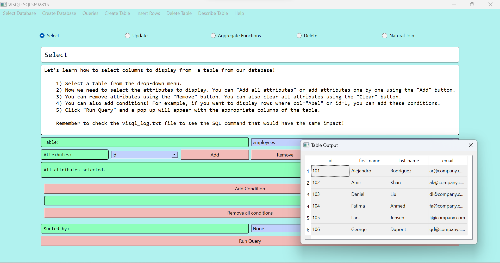
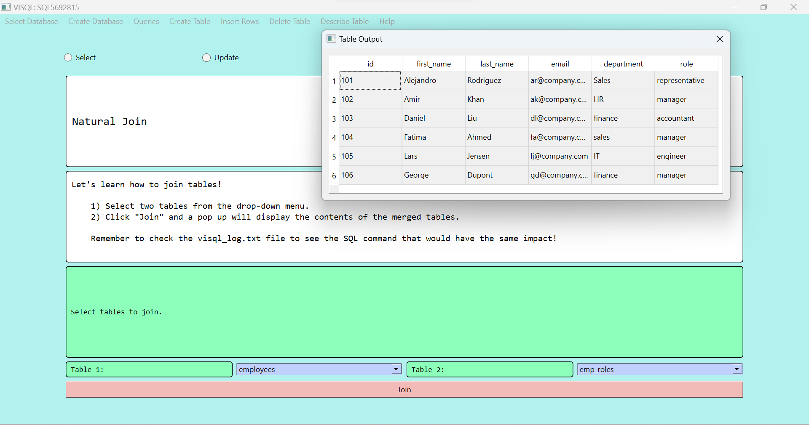

# ViSQL, Your SQL Query Wizard


Hello and welcome to ViSQL! This is meant to be a tool that helps students visually learn SQL.

Most classes teach you SQL by providing a list of commands and having students experiment with them. This can be very unintuitive for beginners (as it was with me).

I  built ViSQL to try to switch things up. Here you can interact with a table through a visual interface! Alongside, ViSQL will produce the SQL commands that correspond to the interactions you make.

I have created a public server so that anyone in the world can use it. This means that if you do not have your own server, then tablkes that you create will be visible to others on the same server. As a student, I do not have the resources to make private servers for everyone who wants to use this tool. But I hope that making at least one public server will help anyone trying to learn SQL.

If you want to use your own server, feel free to replace the contents of server.py and you will have your own private contents.

### Demo pictures



## Instructions
1. Install the project dependencies:
```
pip install -r requirements.txt
```
2. Define the variables `host`, `user` and `session` with the mysql server credentials in `constants.py`.
3. Run the main script
```
python src/main.py
```
4. Read through the Welcome Guide pop-up.
5. Start querying! All queries run during a given session are stored in `src/visql_log.txt`

## Limitations 
1. No join supported except natural join (select queries)
2. Check constraint not supported (create table queries)
3. Foreign keys not supported (create table queries)
4. Cannot change user/host of MySQL server from within the application. Admin must update `constants.py` for this.
5. Alter queries not supported.
(This list will be updated!)
